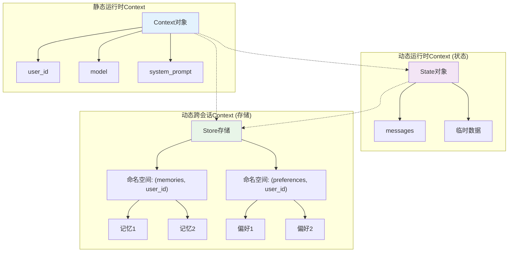

# LangGraph Context 深入指南

## 目录
- [概述](#概述)
- [Context工程核心理念](#context工程核心理念)
- [Context的两个维度](#context的两个维度)
- [三种Context类型详解](#三种context类型详解)
- [项目实战案例分析](#项目实战案例分析)
- [Context最佳实践](#context最佳实践)
- [常见问题与解决方案](#常见问题与解决方案)

## 概述

**Context工程**是构建动态系统的实践，它以正确的格式提供正确的信息和工具，使AI应用能够完成任务。在LangGraph中，Context是智能体获取和使用各种信息的核心机制。

### 为什么需要Context？

想象一个没有Context的智能体：
```python
# ❌ 没有Context的智能体
def simple_agent(user_input):
    return llm.invoke(user_input)  # 只有用户输入，缺乏背景信息
```

有了Context的智能体：
```python
# ✅ 有Context的智能体
def context_aware_agent(user_input, context):
    system_prompt = f"用户名: {context.user_name}, 偏好: {context.preferences}"
    return llm.invoke([
        {"role": "system", "content": system_prompt},
        {"role": "user", "content": user_input}
    ])
```

Context让智能体能够：
- 🎯 **个性化响应**: 根据用户信息调整回答风格
- 🔧 **访问工具**: 使用数据库连接、API密钥等资源
- 💾 **保持状态**: 在对话过程中记住中间结果
- 🌐 **跨会话记忆**: 在不同对话间共享信息

## Context工程核心理念

根据[LangGraph官方文档](https://langchain-ai.github.io/langgraph/agents/context/)，Context工程的核心是**在正确的时间，以正确的格式，提供正确的信息**。

### Context vs LLM Context

⚠️ **重要区别**：
- **Runtime Context**: 代码运行时需要的本地数据和依赖
- **LLM Context**: 传递给LLM提示词的数据
- **Context Window**: LLM能处理的最大token数量

```python
# Runtime Context - 运行时上下文
context = Context(
    user_id="alice-123",
    database_url="postgresql://...",
    api_keys={"openai": "sk-..."}
)

# LLM Context - LLM上下文 (由Runtime Context优化生成)
llm_messages = [
    {"role": "system", "content": f"用户ID: {context.user_id}"},
    {"role": "user", "content": "Hello"}
]
```

## Context的两个维度

LangGraph通过两个关键维度来分类Context：

### 1. 可变性 (Mutability)

```
静态Context (Static)              动态Context (Dynamic)
┌─────────────────────┐          ┌─────────────────────┐
│   不可变数据         │          │    可变数据         │
│   • 用户元数据       │          │   • 对话历史        │
│   • 数据库连接       │          │   • 中间结果        │
│   • 工具配置         │          │   • 工具调用观察    │
└─────────────────────┘          └─────────────────────┘
```

### 2. 生命周期 (Lifetime)

```
运行时Context (Runtime)          跨会话Context (Cross-conversation)
┌─────────────────────┐          ┌─────────────────────┐
│   单次运行范围       │          │   多次会话范围       │
│   • 当前对话状态     │          │   • 用户档案        │
│   • 临时变量         │          │   • 历史偏好        │
│   • 工具调用结果     │          │   • 学习经验        │
└─────────────────────┘          └─────────────────────┘
```

## 三种Context类型详解

根据可变性和生命周期的组合，LangGraph提供三种Context管理方式：

| Context类型 | 描述 | 可变性 | 生命周期 | 访问方式 |
|------------|------|--------|----------|----------|
| **静态运行时Context** | 启动时传入的用户元数据、工具、数据库连接 | 静态 | 单次运行 | `context`参数 |
| **动态运行时Context (状态)** | 单次运行中演化的可变数据 | 动态 | 单次运行 | LangGraph状态对象 |
| **动态跨会话Context (存储)** | 跨会话持久化的共享数据 | 动态 | 跨会话 | LangGraph存储 |

### 1. 静态运行时Context

静态运行时Context代表不可变数据，在运行开始时通过`context`参数传入。

#### 基本用法

```python
from dataclasses import dataclass
from langgraph.runtime import get_runtime

@dataclass
class ContextSchema:
    user_name: str
    user_id: str
    model: str
    api_keys: dict

# 在图调用时传入
result = await graph.ainvoke(
    {"messages": [{"role": "user", "content": "Hello"}]},
    context={
        "user_name": "Alice",
        "user_id": "alice-123", 
        "model": "gpt-4",
        "api_keys": {"openai": "sk-..."}
    }
)
```

#### 在不同组件中访问

**在Agent中使用**：
```python
from langchain_core.messages import AnyMessage
from langgraph.runtime import get_runtime
from langgraph.prebuilt import create_react_agent

def prompt(state) -> list[AnyMessage]:
    runtime = get_runtime(ContextSchema)
    user_name = runtime.context.user_name
    
    system_msg = f"你是一个助手。请称呼用户为{user_name}。"
    return [{"role": "system", "content": system_msg}] + state["messages"]

agent = create_react_agent(
    model="anthropic:claude-3-5-sonnet-latest",
    tools=[get_weather],
    prompt=prompt,
    context_schema=ContextSchema
)
```

**在工作流节点中使用**：
```python
from langgraph.runtime import Runtime

def my_node(state: State, runtime: Runtime[ContextSchema]):
    user_id = runtime.context.user_id
    model = runtime.context.model
    
    # 使用context信息处理逻辑
    result = process_with_user_context(state, user_id, model)
    return {"processed_result": result}
```

**在工具中使用**：
```python
from langgraph.runtime import get_runtime
from langchain_core.tools import tool

@tool
def get_user_profile() -> str:
    """获取用户档案信息"""
    runtime = get_runtime(ContextSchema)
    user_id = runtime.context.user_id
    
    # 从数据库获取用户信息
    profile = database.get_user_profile(user_id)
    return f"用户档案: {profile}"
```

### 2. 动态运行时Context (状态)

动态运行时Context通过LangGraph状态对象管理，代表在单次运行中可以演化的可变数据。

#### 状态定义

```python
from typing_extensions import TypedDict
from langchain_core.messages import AnyMessage
from langgraph.graph import add_messages

class CustomState(TypedDict):
    messages: Annotated[list[AnyMessage], add_messages]
    user_name: str           # 用户名
    conversation_summary: str # 对话摘要
    tool_results: list       # 工具调用结果
    processing_step: int     # 处理步骤计数
```

#### 在Agent中使用状态

```python
from langgraph.prebuilt import create_react_agent
from langgraph.prebuilt.chat_agent_executor import AgentState

class CustomAgentState(AgentState):
    user_preferences: dict
    conversation_context: str

def prompt(state: CustomAgentState) -> list[AnyMessage]:
    user_prefs = state.get("user_preferences", {})
    context = state.get("conversation_context", "")
    
    system_msg = f"""
    你是一个智能助手。
    用户偏好: {user_prefs}
    对话上下文: {context}
    """
    return [{"role": "system", "content": system_msg}] + state["messages"]

agent = create_react_agent(
    model="anthropic:claude-3-5-sonnet-latest",
    tools=[...],
    state_schema=CustomAgentState,
    prompt=prompt
)
```

#### 在工作流中管理状态

```python
from langgraph.graph import StateGraph

def process_input(state: CustomState):
    """处理用户输入"""
    messages = state["messages"]
    last_message = messages[-1].content
    
    # 更新处理步骤
    step = state.get("processing_step", 0) + 1
    
    return {
        "processing_step": step,
        "conversation_summary": f"处理步骤{step}: {last_message[:50]}..."
    }

def call_tools(state: CustomState):
    """调用工具"""
    # 根据状态信息决定调用哪些工具
    if state["processing_step"] > 3:
        return {"tool_results": ["工具A结果", "工具B结果"]}
    return {}

# 构建图
builder = StateGraph(CustomState)
builder.add_node("process_input", process_input)
builder.add_node("call_tools", call_tools)
builder.add_edge("process_input", "call_tools")
```

### 3. 动态跨会话Context (存储)

动态跨会话Context通过LangGraph Store管理，代表跨多个会话持久化的共享数据。

#### 基本存储操作

```python
from langgraph.store.memory import InMemoryStore

# 创建存储
store = InMemoryStore()

# 存储用户偏好
await store.aput(
    namespace=("user_preferences", "alice-123"),
    key="communication_style",
    value={
        "language": "中文",
        "tone": "友好",
        "detail_level": "简洁"
    }
)

# 检索用户偏好
preferences = await store.aget(
    namespace=("user_preferences", "alice-123"),
    key="communication_style"
)
```

#### 在节点中使用存储

```python
from langgraph.runtime import Runtime
from langgraph.store.base import BaseStore

async def personalized_response(state: State, runtime: Runtime[ContextSchema]):
    user_id = runtime.context.user_id
    store = runtime.store
    
    # 检索用户历史偏好
    preferences = await store.asearch(
        namespace=("preferences", user_id),
        query="通信风格"
    )
    
    # 检索相关记忆
    memories = await store.asearch(
        namespace=("memories", user_id),
        query=str(state["messages"][-1].content)
    )
    
    # 基于偏好和记忆生成响应
    context_info = {
        "preferences": [p.value for p in preferences],
        "memories": [m.value for m in memories]
    }
    
    return {"context_info": context_info}
```

## 项目实战案例分析

让我们分析当前memory-agent项目中Context的实际使用：

### 项目中的Context定义

```python
# src/memory_agent/context.py
@dataclass(kw_only=True)
class Context:
    user_id: str = "default"
    model: str = "anthropic/claude-3-5-sonnet-20240620"
    system_prompt: str = SYSTEM_PROMPT
    
    def __post_init__(self):
        # 自动从环境变量加载配置
        for f in fields(self):
            if getattr(self, f.name) == f.default:
                env_value = os.environ.get(f.name.upper(), f.default)
                setattr(self, f.name, env_value)
```

这是一个**静态运行时Context**的典型实现，包含：
- `user_id`: 用户标识符
- `model`: 模型配置
- `system_prompt`: 系统提示词

### Context在图中的使用

```python
# src/memory_agent/graph.py
async def call_model(state: State, runtime: Runtime[Context]) -> dict:
    # 1. 从Context获取配置
    user_id = runtime.context.user_id
    model = runtime.context.model
    system_prompt = runtime.context.system_prompt
    
    # 2. 从Store获取跨会话数据
    memories = await cast(BaseStore, runtime.store).asearch(
        ("memories", user_id),  # 使用user_id构建命名空间
        query=str([m.content for m in state.messages[-3:]]),
        limit=10,
    )
    
    # 3. 结合Context和Store数据
    formatted_memories = "\n".join(
        f"[{mem.key}]: {mem.value} (similarity: {mem.score})" 
        for mem in memories
    )
    
    # 4. 构建最终的LLM上下文
    sys = system_prompt.format(
        user_info=formatted_memories, 
        time=datetime.now().isoformat()
    )
    
    # 5. 调用模型
    current_llm = get_model(model)
    msg = await current_llm.bind_tools([tools.upsert_memory]).ainvoke(
        [{"role": "system", "content": sys}, *state.messages],
    )
    return {"messages": [msg]}
```

### Context的三层架构

在我们的项目中，Context形成了三层架构：



### 实际调用示例

```python
# tests/integration_tests/test_graph.py
async def test_memory_storage():
    # 1. 创建存储 (跨会话Context)
    mem_store = InMemoryStore()
    
    # 2. 编译图 (状态Context)
    graph = builder.compile(store=mem_store, checkpointer=MemorySaver())
    
    # 3. 调用时传入静态Context
    result = await graph.ainvoke(
        {"messages": [("user", "我叫Alice，喜欢披萨")]},  # 动态状态
        {"thread_id": "test-thread"},                    # 状态标识
        context=Context(                                # 静态Context
            user_id="test-user",
            model="azure_openai/gpt-4o"
        ),
    )
```

## Context最佳实践

### 1. Context设计原则

```python
# ✅ 好的Context设计
@dataclass
class WellDesignedContext:
    # 核心标识
    user_id: str
    session_id: str
    
    # 配置信息
    model: str = "gpt-4"
    language: str = "zh-CN"
    
    # 资源连接
    database_url: Optional[str] = None
    api_keys: dict = field(default_factory=dict)
    
    # 功能开关
    enable_memory: bool = True
    enable_tools: bool = True

# ❌ 避免的Context设计
@dataclass
class PoorContext:
    data: dict  # 过于宽泛
    config: str  # 类型不明确
    everything: Any  # 没有结构
```

### 2. Context访问模式

```python
# ✅ 安全的Context访问
def safe_context_access(runtime: Runtime[Context]):
    try:
        user_id = runtime.context.user_id
        model = getattr(runtime.context, 'model', 'default-model')
        return user_id, model
    except AttributeError as e:
        logger.error(f"Context访问错误: {e}")
        return "default-user", "default-model"

# ✅ Context验证
def validate_context(context: Context) -> bool:
    required_fields = ['user_id', 'model']
    for field in required_fields:
        if not getattr(context, field, None):
            raise ValueError(f"Context缺少必需字段: {field}")
    return True
```

### 3. Context与Store的协作

```python
async def context_store_integration(
    state: State, 
    runtime: Runtime[Context]
) -> dict:
    user_id = runtime.context.user_id
    store = runtime.store
    
    # 1. 使用Context信息构建命名空间
    user_namespace = ("users", user_id)
    session_namespace = ("sessions", runtime.context.session_id)
    
    # 2. 基于Context检索相关数据
    user_data = await store.asearch(user_namespace)
    session_data = await store.asearch(session_namespace)
    
    # 3. 结合Context和Store数据做决策
    if runtime.context.enable_memory and user_data:
        # 使用记忆增强响应
        enhanced_prompt = build_memory_enhanced_prompt(
            base_prompt=runtime.context.system_prompt,
            memories=user_data
        )
    else:
        enhanced_prompt = runtime.context.system_prompt
    
    return {"enhanced_prompt": enhanced_prompt}
```

### 4. Context的生命周期管理

```python
class ContextManager:
    def __init__(self):
        self.active_contexts = {}
    
    async def create_context(self, user_id: str, **kwargs) -> Context:
        """创建新的Context"""
        context = Context(user_id=user_id, **kwargs)
        
        # 验证Context
        self.validate_context(context)
        
        # 初始化相关资源
        await self.initialize_resources(context)
        
        # 缓存Context
        self.active_contexts[user_id] = context
        return context
    
    async def cleanup_context(self, user_id: str):
        """清理Context资源"""
        if user_id in self.active_contexts:
            context = self.active_contexts[user_id]
            await self.cleanup_resources(context)
            del self.active_contexts[user_id]
    
    async def initialize_resources(self, context: Context):
        """初始化Context相关资源"""
        if context.database_url:
            # 初始化数据库连接
            pass
        
        if context.api_keys:
            # 验证API密钥
            pass
    
    async def cleanup_resources(self, context: Context):
        """清理Context相关资源"""
        # 关闭数据库连接、清理缓存等
        pass
```

### 5. Context的测试策略

```python
# 测试静态Context
@pytest.fixture
def test_context():
    return Context(
        user_id="test-user",
        model="test-model",
        system_prompt="测试提示词"
    )

async def test_context_usage(test_context):
    # 模拟图调用
    result = await graph.ainvoke(
        {"messages": [("user", "test")]},
        context=test_context
    )
    
    # 验证Context是否正确使用
    assert "test-user" in str(result)

# 测试Context和Store的集成
async def test_context_store_integration():
    store = InMemoryStore()
    context = Context(user_id="integration-test")
    
    # 预设数据
    await store.aput(
        ("users", "integration-test"),
        "profile",
        {"name": "Test User"}
    )
    
    # 测试集成
    result = await graph.ainvoke(
        {"messages": [("user", "Hello")]},
        context=context,
        store=store
    )
    
    assert result is not None
```

## 常见问题与解决方案

### Q1: Context数据过大导致性能问题

**问题**: Context包含大量数据，影响传递和访问性能。

**解决方案**:
```python
# ✅ 延迟加载Context
@dataclass
class LazyContext:
    user_id: str
    _user_profile: Optional[dict] = None
    _database_connection: Optional[Any] = None
    
    async def get_user_profile(self) -> dict:
        if self._user_profile is None:
            self._user_profile = await load_user_profile(self.user_id)
        return self._user_profile
    
    async def get_database(self):
        if self._database_connection is None:
            self._database_connection = await create_db_connection()
        return self._database_connection

# ✅ Context分层
@dataclass
class CoreContext:
    user_id: str
    session_id: str

@dataclass
class ExtendedContext(CoreContext):
    preferences: dict = field(default_factory=dict)
    tools_config: dict = field(default_factory=dict)
```

### Q2: Context在不同组件间不一致

**问题**: 在Agent、工具、节点中访问到的Context不一致。

**解决方案**:
```python
# ✅ Context单例模式
class ContextSingleton:
    _instance = None
    _context = None
    
    def __new__(cls):
        if cls._instance is None:
            cls._instance = super().__new__(cls)
        return cls._instance
    
    def set_context(self, context: Context):
        self._context = context
    
    def get_context(self) -> Context:
        if self._context is None:
            raise RuntimeError("Context未初始化")
        return self._context

# ✅ Context验证中间件
async def context_validation_middleware(
    state: State, 
    runtime: Runtime[Context]
) -> dict:
    # 验证Context完整性
    required_fields = ['user_id', 'model']
    for field in required_fields:
        if not getattr(runtime.context, field, None):
            raise ValueError(f"Context缺少字段: {field}")
    
    # 验证Context和Store的一致性
    user_id = runtime.context.user_id
    store_user_data = await runtime.store.asearch(("users", user_id))
    
    if store_user_data and store_user_data[0].value.get("user_id") != user_id:
        raise ValueError("Context和Store中的user_id不一致")
    
    return state
```

### Q3: Context安全性问题

**问题**: Context中包含敏感信息，存在泄露风险。

**解决方案**:
```python
# ✅ 敏感信息加密
from cryptography.fernet import Fernet

@dataclass
class SecureContext:
    user_id: str
    _encrypted_api_keys: bytes
    _cipher: Fernet = field(init=False)
    
    def __post_init__(self):
        # 初始化加密器
        key = os.environ.get("CONTEXT_ENCRYPTION_KEY").encode()
        self._cipher = Fernet(key)
    
    def get_api_key(self, service: str) -> str:
        # 解密API密钥
        decrypted_keys = json.loads(
            self._cipher.decrypt(self._encrypted_api_keys).decode()
        )
        return decrypted_keys.get(service)
    
    def set_api_keys(self, keys: dict):
        # 加密存储API密钥
        self._encrypted_api_keys = self._cipher.encrypt(
            json.dumps(keys).encode()
        )

# ✅ Context访问控制
class ContextAccessControl:
    def __init__(self):
        self.permissions = {}
    
    def grant_permission(self, component: str, fields: list[str]):
        self.permissions[component] = fields
    
    def check_access(self, component: str, field: str) -> bool:
        allowed_fields = self.permissions.get(component, [])
        return field in allowed_fields or field in ["user_id"]  # user_id总是允许
    
    def filter_context(self, context: Context, component: str) -> dict:
        filtered = {}
        for field in fields(context):
            if self.check_access(component, field.name):
                filtered[field.name] = getattr(context, field.name)
        return filtered
```

### Q4: Context版本兼容性问题

**问题**: Context结构变更导致旧版本不兼容。

**解决方案**:
```python
# ✅ Context版本管理
@dataclass
class VersionedContext:
    version: str = "1.0"
    user_id: str = ""
    model: str = "gpt-4"
    
    @classmethod
    def from_dict(cls, data: dict) -> 'VersionedContext':
        version = data.get("version", "1.0")
        
        if version == "1.0":
            return cls(**data)
        elif version == "2.0":
            # 处理版本2.0的差异
            return cls.migrate_from_v2(data)
        else:
            raise ValueError(f"不支持的Context版本: {version}")
    
    @classmethod
    def migrate_from_v2(cls, data: dict) -> 'VersionedContext':
        # 从v2.0迁移到当前版本
        migrated_data = {
            "version": "1.0",
            "user_id": data.get("userId", ""),  # 字段名变更
            "model": data.get("llm_model", "gpt-4")  # 字段名变更
        }
        return cls(**migrated_data)

# ✅ Context模式验证
from pydantic import BaseModel, validator

class ValidatedContext(BaseModel):
    user_id: str
    model: str
    language: str = "zh-CN"
    
    @validator('user_id')
    def validate_user_id(cls, v):
        if not v or len(v) < 3:
            raise ValueError('user_id必须至少3个字符')
        return v
    
    @validator('model')
    def validate_model(cls, v):
        allowed_models = ['gpt-4', 'claude-3', 'azure_openai/gpt-4o']
        if v not in allowed_models:
            raise ValueError(f'不支持的模型: {v}')
        return v
```

## 总结

LangGraph的Context系统为AI智能体提供了强大而灵活的上下文管理能力。通过理解**静态运行时Context**、**动态运行时Context（状态）**和**动态跨会话Context（存储）**三种类型，开发者可以构建出具有丰富上下文感知能力的智能应用。

### 关键要点回顾

1. **Context工程核心**: 在正确的时间，以正确的格式，提供正确的信息
2. **三种Context类型**: 静态运行时、动态运行时（状态）、动态跨会话（存储）
3. **设计原则**: 结构化、安全性、性能优化、版本兼容性
4. **实践经验**: 从本项目的实现中学习最佳实践和常见陷阱

### Context系统的价值

- 🎯 **个性化**: 根据用户Context提供定制化服务
- 🔧 **工具集成**: 通过Context访问各种外部资源
- 💾 **状态管理**: 在对话过程中保持和演化状态
- 🌐 **跨会话记忆**: 在不同会话间共享和学习信息

掌握Context系统，将帮助您构建更智能、更有用的AI应用！

---

**参考资料**:
- [LangGraph Context 官方文档](https://langchain-ai.github.io/langgraph/agents/context/)
- [LangGraph Memory 概念](https://langchain-ai.github.io/langgraph/concepts/memory/)
- 本项目源码 - Context系统的实际实现示例
