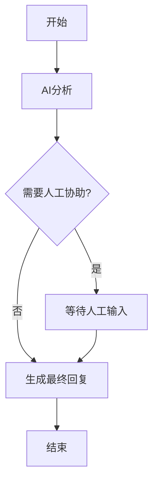
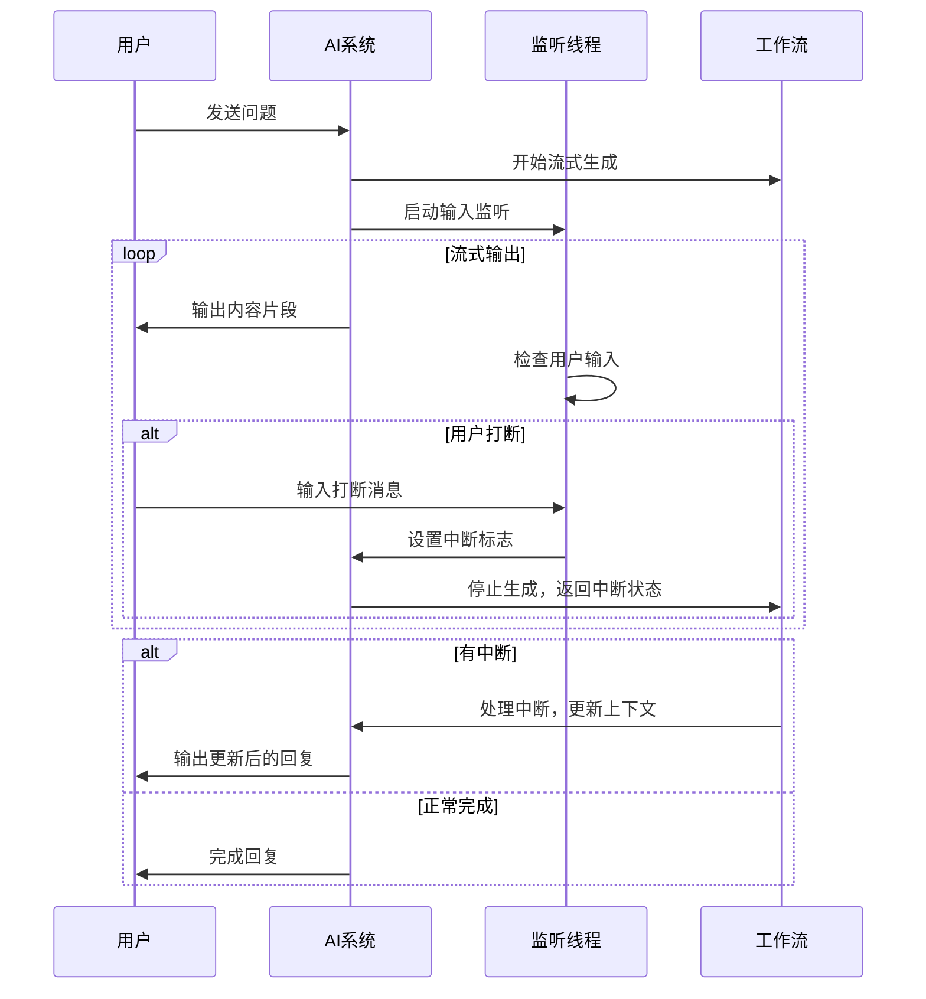
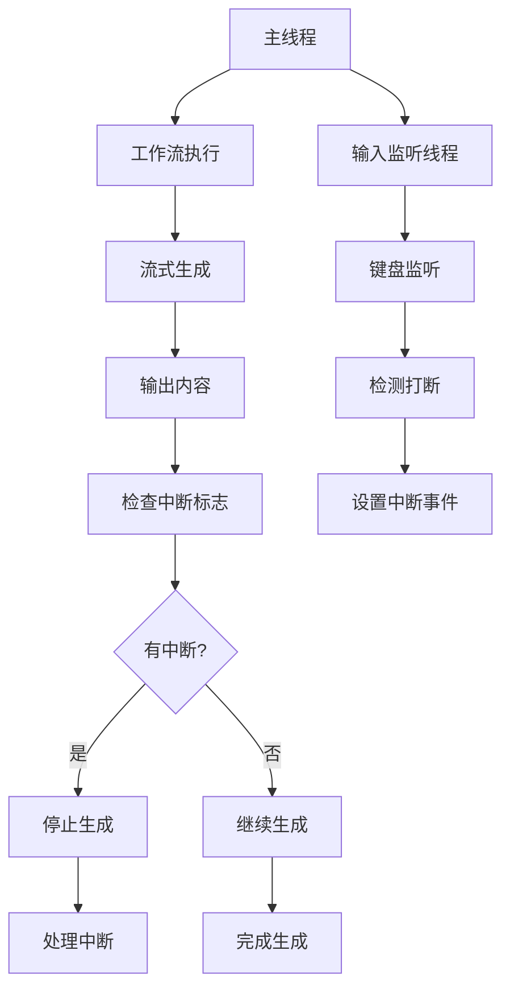

# LangGraph Human-in-the-Loop 完整指南

## 目录
1. [概述](#概述)
2. [基础概念](#基础概念)
3. [基本人机交互模式](#基本人机交互模式)
4. [流式输出与用户打断](#流式输出与用户打断)
5. [高级流式人机交互](#高级流式人机交互)
6. [上下文更新机制](#上下文更新机制)
7. [实现原理详解](#实现原理详解)
8. [最佳实践](#最佳实践)
9. [实际应用场景](#实际应用场景)

## 概述

Human-in-the-Loop（人机交互循环）是AI系统设计中的重要模式，允许人工在AI处理过程中介入、指导和修正。LangGraph 提供了强大的人机交互功能，支持多种交互模式，从简单的人工审核到复杂的实时打断和上下文更新。

### 核心价值
- **提高准确性**：人工介入可以纠正AI的错误判断
- **增强可控性**：用户可以实时调整AI的行为方向
- **改善用户体验**：支持更自然的人机对话交互
- **确保安全性**：在关键决策点引入人工审核

## 基础概念

### 1. Human-in-the-Loop 的基本类型

#### 🔄 审核模式（Review Mode）
AI完成任务后，等待人工审核和反馈

#### ⚡ 实时打断模式（Real-time Interrupt Mode）
AI执行过程中，用户可以实时打断并提供新的指导

#### 🎯 协作模式（Collaboration Mode）
AI和人工在任务执行过程中密切协作，互相补充

### 2. 关键组件

```python
from typing_extensions import TypedDict
from langgraph.graph import StateGraph, START, END
from langgraph.types import Command, interrupt

class HumanInLoopState(TypedDict):
    """人机交互状态定义"""
    task: str                    # 用户任务
    ai_response: str            # AI回复
    human_input_needed: bool    # 是否需要人工输入
    human_feedback: str         # 人工反馈
    final_output: str          # 最终输出
    interrupt_requested: bool   # 是否请求中断
    context_updated: bool      # 上下文是否已更新
```

## 基本人机交互模式

### 1. 简单审核模式实现

这是最基础的人机交互模式，AI完成分析后等待人工反馈：

```python
class BasicHumanInLoopDemo:
    def __init__(self):
        self.llm = ChatOpenAI(
            model="deepseek-chat",
            openai_api_key=os.getenv("LLM_API_KEY"),
            base_url=os.getenv("LLM_BASE_URL")
        )
        
        # AI分析提示
        self.ai_prompt = ChatPromptTemplate.from_messages([
            ("system", """你是一个智能助手，负责分析用户的请求。
            当用户请求专家建议或需要人工协助时，你应该识别出这种需求。
            如果需要人工协助，请在回复中包含"需要人工协助"这个短语。"""),
            ("user", "{task}")
        ])
        
        # 最终回复提示
        self.final_prompt = ChatPromptTemplate.from_messages([
            ("system", """基于人工专家的反馈给用户最终回复。
            请整合专家的建议，给出完整、有用的回答。"""),
            ("user", "用户任务：{task}\n\n专家反馈：{human_feedback}")
        ])
    
    async def ai_analysis_step(self, state: HumanInLoopState) -> Dict:
        """AI分析步骤"""
        try:
            analysis_chain = self.ai_prompt | self.llm
            result = await analysis_chain.ainvoke({"task": state["task"]})
            
            ai_response = result.content
            # 检查是否需要人工协助
            need_human = "需要人工协助" in ai_response or "专家建议" in state["task"]
            
            return {
                "ai_response": ai_response,
                "human_input_needed": need_human
            }
        except Exception as e:
            return {
                "ai_response": f"分析过程中出现错误: {str(e)}",
                "human_input_needed": False
            }
    
    def human_input_step(self, state: HumanInLoopState) -> Dict:
        """人工输入步骤"""
        print(f"🤖 AI分析结果: {state['ai_response']}")
        print("🤖 系统提示: AI代理请求人工协助")
        print(f"📝 用户任务: {state['task']}")
        
        # 模拟专家反馈（实际应用中会等待真实人工输入）
        human_feedback = self._get_expert_feedback(state["task"])
        print(f"👨‍💼 专家反馈: {human_feedback}")
        
        return {"human_feedback": human_feedback}
    
    async def final_response_step(self, state: HumanInLoopState) -> Dict:
        """最终回复步骤"""
        try:
            final_chain = self.final_prompt | self.llm
            result = await final_chain.ainvoke({
                "task": state["task"],
                "human_feedback": state["human_feedback"]
            })
            
            return {"final_output": result.content}
        except Exception as e:
            return {"final_output": f"生成最终回复时出现错误: {str(e)}"}
    
    def decide_next_step(self, state: HumanInLoopState) -> str:
        """决定下一步操作"""
        if state.get("human_input_needed", False) and not state.get("human_feedback"):
            return "human_input"
        else:
            return "final_response"
    
    def _create_workflow(self):
        """创建工作流"""
        workflow = StateGraph(HumanInLoopState)
        
        # 添加节点
        workflow.add_node("ai_analysis", self.ai_analysis_step)
        workflow.add_node("human_input", self.human_input_step)
        workflow.add_node("final_response", self.final_response_step)
        
        # 定义流程
        workflow.add_edge(START, "ai_analysis")
        workflow.add_conditional_edges(
            "ai_analysis",
            self.decide_next_step,
            {
                "human_input": "human_input",
                "final_response": "final_response"
            }
        )
        workflow.add_edge("human_input", "final_response")
        workflow.add_edge("final_response", END)
        
        return workflow.compile()
```

### 2. 工作流程图



## 流式输出与用户打断

### 1. 基础流式打断实现

流式输出允许用户看到AI的实时生成过程，并支持中途打断：

```python
class StreamingInterruptDemo:
    def __init__(self):
        self.llm = ChatOpenAI(
            model="deepseek-chat",
            streaming=True  # 启用流式输出
        )
        
        # 用户输入队列和中断事件
        self.user_input_queue = Queue()
        self.interrupt_event = threading.Event()
    
    async def streaming_response_node(self, state: StreamingInterruptState) -> Dict:
        """流式响应节点"""
        try:
            streaming_content = ""
            interrupt_detected = False
            user_interrupt_message = ""
            
            print(f"🤖 AI正在回复: ", end="", flush=True)
            print(f"💡 提示: 您可以直接输入新消息并按回车来打断AI回复")
            
            # 重置中断状态
            self.interrupt_event.clear()
            self._clear_input_queue()
            
            # 启动用户输入监听线程
            input_thread = threading.Thread(
                target=self._listen_for_user_input, 
                daemon=True
            )
            input_thread.start()
            
            # 流式生成响应
            async for chunk in self.response_chain.astream({
                "conversation_history": self._format_history(state),
                "user_input": state["user_input"]
            }):
                if hasattr(chunk, 'content') and chunk.content:
                    content = chunk.content
                    streaming_content += content
                    print(content, end="", flush=True)
                    
                    # 检查用户打断
                    if self.interrupt_event.is_set():
                        try:
                            user_interrupt_message = self.user_input_queue.get_nowait()
                            interrupt_detected = True
                            break
                        except Empty:
                            pass
                    
                    # 控制输出速度
                    await asyncio.sleep(0.1)
            
            print()  # 换行
            
            if interrupt_detected:
                print("🔄 检测到用户打断，正在处理...")
                return {
                    "ai_response": streaming_content,
                    "streaming_content": streaming_content,
                    "interrupt_requested": True,
                    "user_interrupt": user_interrupt_message,
                    "context_updated": False
                }
            else:
                return {
                    "ai_response": streaming_content,
                    "interrupt_requested": False,
                    "context_updated": False
                }
                
        except Exception as e:
            return {
                "ai_response": f"生成回复时出现错误: {str(e)}",
                "interrupt_requested": False,
                "context_updated": False
            }
    
    def _listen_for_user_input(self):
        """监听用户输入的后台线程"""
        import select
        import sys
        
        try:
            input_buffer = ""
            while not self.interrupt_event.is_set():
                if hasattr(select, 'select'):
                    ready, _, _ = select.select([sys.stdin], [], [], 0.1)
                    if ready:
                        char = sys.stdin.read(1)
                        if char == '\r' or char == '\n':  # 回车键
                            if input_buffer.strip():
                                self.user_input_queue.put(input_buffer.strip())
                                self.interrupt_event.set()
                                print(f"\n⚠️ 检测到用户打断: {input_buffer.strip()}")
                                break
                        elif char.isprintable():
                            input_buffer += char
                            print(char, end='', flush=True)
                else:
                    time.sleep(0.1)
        except Exception as e:
            logger.debug(f"输入监听异常: {e}")
```

### 2. 打断处理流程



## 高级流式人机交互

### 1. 跨平台输入监听

高级版本支持Windows和Unix/Linux系统的键盘输入监听：

```python
class InterruptHandler:
    """中断处理器 - 跨平台输入监听"""
    
    def __init__(self):
        self.input_queue = Queue()
        self.interrupt_event = threading.Event()
        self.listening = False
        self.input_thread = None
        self._stop_listening = threading.Event()
    
    def start_listening(self):
        """开始监听用户输入"""
        if self.listening:
            return
        
        self.listening = True
        self._stop_listening.clear()
        self.interrupt_event.clear()
        
        # 清空输入队列
        self._clear_queue()
        
        # 启动监听线程
        self.input_thread = threading.Thread(
            target=self._listen_loop, 
            daemon=True
        )
        self.input_thread.start()
    
    def _listen_loop(self):
        """监听循环 - 跨平台实现"""
        print("💡 提示: 在AI回复过程中输入消息可以打断AI (按Enter确认)")
        
        while not self._stop_listening.is_set():
            try:
                import sys
                import platform
                
                if platform.system() == "Windows":
                    # Windows系统实现
                    self._windows_input_handler()
                else:
                    # Unix/Linux系统实现
                    self._unix_input_handler()
                    
            except Exception as e:
                logger.debug(f"监听输入时出错: {e}")
                time.sleep(0.1)
    
    def _windows_input_handler(self):
        """Windows系统的输入处理"""
        try:
            import msvcrt
            if msvcrt.kbhit():
                chars = []
                while msvcrt.kbhit():
                    char = msvcrt.getch().decode('utf-8', errors='ignore')
                    if char == '\r':  # 回车键
                        break
                    elif char == '\b':  # 退格键
                        if chars:
                            chars.pop()
                            print('\b \b', end='', flush=True)
                    elif ord(char) >= 32:  # 可打印字符
                        chars.append(char)
                        print(char, end='', flush=True)
                
                user_input = ''.join(chars).strip()
                if user_input:
                    self.input_queue.put(user_input)
                    self.interrupt_event.set()
                    print()  # 换行
            
            time.sleep(0.1)
        except ImportError:
            time.sleep(0.1)
    
    def _unix_input_handler(self):
        """Unix/Linux系统的输入处理"""
        import select
        import sys
        
        if hasattr(select, 'select'):
            ready, _, _ = select.select([sys.stdin], [], [], 0.1)
            if ready and not self._stop_listening.is_set():
                user_input = sys.stdin.readline().strip()
                if user_input:
                    self.input_queue.put(user_input)
                    self.interrupt_event.set()
        else:
            time.sleep(0.1)
```

### 2. 会话管理

高级版本支持多会话管理和状态持久化：

```python
class AdvancedStreamingInterruptDemo:
    def __init__(self):
        # ... 其他初始化代码 ...
        
        # 检查点保存器
        self.checkpointer = MemorySaver()
        self.workflow = self._create_workflow()
        
        # 中断处理器
        self.interrupt_handler = InterruptHandler()
        
        # 会话管理
        self.sessions = {}
    
    def create_session(self, session_id: Optional[str] = None) -> str:
        """创建新的对话会话"""
        if not session_id:
            session_id = f"session_{int(time.time())}"
        
        self.sessions[session_id] = {
            "created_at": datetime.now().isoformat(),
            "message_count": 0,
            "last_activity": datetime.now().isoformat()
        }
        
        return session_id
    
    async def chat(self, user_input: str, session_id: str) -> Dict[str, Any]:
        """进行对话"""
        # 更新会话信息
        if session_id in self.sessions:
            self.sessions[session_id]["message_count"] += 1
            self.sessions[session_id]["last_activity"] = datetime.now().isoformat()
        
        config = {"configurable": {"thread_id": session_id}}
        
        # 获取对话历史
        try:
            current_state = self.workflow.get_state(config)
            conversation_history = current_state.values.get("conversation_history", []) if current_state.values else []
        except:
            conversation_history = []
        
        # 创建初始状态
        inputs = AdvancedStreamingState(
            user_input=user_input,
            ai_response="",
            conversation_history=conversation_history,
            interrupt_requested=False,
            user_interrupt="",
            streaming_content="",
            context_updated=False,
            session_id=session_id,
            timestamp=datetime.now().isoformat(),
            metadata={}
        )
        
        # 运行工作流
        result_steps = []
        async for event in self.workflow.astream(inputs, config):
            for k, v in event.items():
                if k != "__end__":
                    result_steps.append({k: v})
                    
                    # 检查中断
                    if k == "streaming_response" and v.get("interrupt_requested"):
                        return {
                            "status": "interrupted",
                            "session_id": session_id,
                            "interrupt_data": {
                                "original_input": user_input,
                                "streaming_content": v.get("streaming_content", ""),
                                "user_interrupt": v.get("user_interrupt", "")
                            },
                            "steps": result_steps
                        }
        
        return {
            "status": "completed",
            "session_id": session_id,
            "steps": result_steps
        }
```

## 上下文更新机制

### 1. 基于打断的上下文更新

当用户打断AI时，系统需要理解用户的意图并相应更新回复：

```python
async def context_update_node(self, state: AdvancedStreamingState) -> Dict:
    """上下文更新节点"""
    try:
        # 构建上下文更新提示
        update_prompt = ChatPromptTemplate.from_messages([
            ("system", """用户在你回复过程中打断了你。请根据以下信息重新组织回复：

原始问题：{original_input}
已输出内容：{streaming_content}
用户打断：{user_interrupt}
对话历史：{conversation_history}

请根据用户的打断要求重新组织回复：
1. 如果用户说"简单点"，请用更简洁的方式回答原始问题
2. 如果用户说"详细点"，请提供更详细的信息
3. 如果用户提出了新问题，请回答新问题
4. 如果用户要求修正或补充，请相应调整内容

请提供一个完整的、符合用户要求的回复。""")
        ])
        
        # 格式化对话历史
        history_str = self._format_conversation_history(
            state.get("conversation_history", [])
        )
        
        # 生成更新后的回复
        update_chain = update_prompt | self.llm
        result = await update_chain.ainvoke({
            "original_input": state["user_input"],
            "conversation_history": history_str,
            "streaming_content": state.get("streaming_content", ""),
            "user_interrupt": state.get("user_interrupt", "")
        })
        
        new_response = result.content
        
        print(f"\n🔄 基于您的打断生成的新回复:")
        print(f"🤖 AI: {new_response}")
        
        return {
            "ai_response": new_response,
            "context_updated": True,
            "interrupt_requested": False,
            "metadata": {
                "context_updated_at": datetime.now().isoformat(),
                "update_reason": "user_interrupt"
            }
        }
        
    except Exception as e:
        return {
            "ai_response": f"更新上下文时出现错误: {str(e)}",
            "context_updated": True,
            "interrupt_requested": False,
            "metadata": {"error": str(e)}
        }
```

### 2. 对话历史管理

```python
def conversation_update_node(self, state: AdvancedStreamingState) -> Dict:
    """对话更新节点"""
    conversation_history = state.get("conversation_history", []).copy()
    
    # 添加用户输入
    conversation_history.append({
        "role": "user",
        "content": state["user_input"],
        "timestamp": state.get("timestamp", datetime.now().isoformat())
    })
    
    # 添加AI回复
    conversation_history.append({
        "role": "assistant", 
        "content": state["ai_response"],
        "timestamp": datetime.now().isoformat(),
        "metadata": state.get("metadata", {})
    })
    
    # 如果有用户打断，添加打断信息
    if state.get("user_interrupt"):
        conversation_history.append({
            "role": "user",
            "content": state["user_interrupt"],
            "timestamp": datetime.now().isoformat(),
            "type": "interrupt"
        })
    
    # 限制历史长度（保留最近20条消息）
    if len(conversation_history) > 20:
        conversation_history = conversation_history[-20:]
    
    return {"conversation_history": conversation_history}

def _format_conversation_history(self, history: List[Dict]) -> str:
    """格式化对话历史"""
    if not history:
        return "暂无对话历史"
    
    formatted = []
    for msg in history[-10:]:  # 只处理最近10条消息
        role = msg.get("role", "unknown")
        content = msg.get("content", "")
        msg_type = msg.get("type", "")
        
        if msg_type == "interrupt":
            formatted.append(f"[用户打断] {content}")
        elif role == "user":
            formatted.append(f"用户: {content}")
        elif role == "assistant":
            formatted.append(f"助手: {content}")
    
    return "\n".join(formatted)
```

### 3. 智能路由决策

```python
def decide_next_step(self, state: AdvancedStreamingState) -> str:
    """决定工作流的下一步操作"""
    if state.get("interrupt_requested", False) and not state.get("context_updated", False):
        # 需要更新上下文
        return "context_update"
    else:
        # 直接更新对话历史
        return "conversation_update"
```

## 实现原理详解

### 1. 多线程架构



### 2. 状态流转

```python
# 状态流转示例
initial_state = {
    "user_input": "请介绍人工智能",
    "ai_response": "",
    "interrupt_requested": False,
    "user_interrupt": "",
    "context_updated": False
}

# 流式生成过程中
streaming_state = {
    "user_input": "请介绍人工智能", 
    "ai_response": "人工智能是一门综合性学科...",
    "streaming_content": "人工智能是一门综合性学科...",
    "interrupt_requested": True,  # 用户打断
    "user_interrupt": "简单点",
    "context_updated": False
}

# 上下文更新后
updated_state = {
    "user_input": "请介绍人工智能",
    "ai_response": "人工智能就是让机器具备智能的技术。",
    "interrupt_requested": False,
    "user_interrupt": "简单点", 
    "context_updated": True
}
```

### 3. 异步处理机制

```python
async def streaming_with_interrupt():
    """流式处理与中断的异步协调"""
    
    # 启动监听线程
    interrupt_handler.start_listening()
    
    try:
        # 异步流式生成
        async for chunk in llm_stream:
            # 输出内容
            print(chunk.content, end="", flush=True)
            
            # 检查中断
            if interrupt_handler.check_interrupt():
                # 处理中断
                break
            
            # 控制速度
            await asyncio.sleep(0.03)
    
    finally:
        # 确保停止监听
        interrupt_handler.stop_listening()
```

## 最佳实践

### 1. 错误处理与恢复

```python
class RobustHumanInLoop:
    async def safe_streaming_response(self, state):
        """安全的流式响应处理"""
        try:
            return await self.streaming_response_node(state)
        except KeyboardInterrupt:
            # 用户强制中断
            return {
                "ai_response": "用户强制中断了对话",
                "interrupt_requested": True,
                "user_interrupt": "[强制中断]"
            }
        except Exception as e:
            logger.error(f"流式响应出错: {e}")
            return {
                "ai_response": f"生成回复时出现错误: {str(e)}",
                "interrupt_requested": False
            }
    
    def with_timeout(self, func, timeout=30):
        """为人工输入添加超时机制"""
        import signal
        
        def timeout_handler(signum, frame):
            raise TimeoutError("人工输入超时")
        
        signal.signal(signal.SIGALRM, timeout_handler)
        signal.alarm(timeout)
        
        try:
            result = func()
            signal.alarm(0)  # 取消超时
            return result
        except TimeoutError:
            return {"human_feedback": "输入超时，使用默认处理"}
```

### 2. 性能优化

```python
class OptimizedHumanInLoop:
    def __init__(self):
        # 使用连接池
        self.llm = ChatOpenAI(
            model="deepseek-chat",
            streaming=True,
            max_retries=3,
            request_timeout=30
        )
        
        # 限制历史长度
        self.max_history_length = 20
        
        # 缓存常用响应
        self.response_cache = {}
    
    def _optimize_history(self, history):
        """优化对话历史"""
        if len(history) > self.max_history_length:
            # 保留最近的消息
            return history[-self.max_history_length:]
        return history
    
    async def _cached_response(self, prompt_key, inputs):
        """缓存响应"""
        cache_key = f"{prompt_key}_{hash(str(inputs))}"
        
        if cache_key in self.response_cache:
            return self.response_cache[cache_key]
        
        result = await self.llm.ainvoke(inputs)
        self.response_cache[cache_key] = result
        
        return result
```

### 3. 用户体验优化

```python
class UserFriendlyHumanInLoop:
    def __init__(self):
        self.typing_speed = 0.03  # 打字机效果速度
        self.show_progress = True
        
    async def enhanced_streaming_output(self, content_stream):
        """增强的流式输出"""
        print("🤖 AI: ", end="", flush=True)
        
        if self.show_progress:
            print("💭 思考中...", end="", flush=True)
            await asyncio.sleep(0.5)
            print("\r🤖 AI: ", end="", flush=True)
        
        total_content = ""
        async for chunk in content_stream:
            if chunk.content:
                total_content += chunk.content
                print(chunk.content, end="", flush=True)
                await asyncio.sleep(self.typing_speed)
        
        print()  # 换行
        return total_content
    
    def show_interrupt_help(self):
        """显示打断帮助信息"""
        print("\n" + "="*50)
        print("💡 打断提示:")
        print("  - 输入 '简单点' 要求简化回答")
        print("  - 输入 '详细点' 要求详细说明") 
        print("  - 输入新问题切换话题")
        print("  - 输入 '停止' 结束当前回复")
        print("="*50)
```

### 4. 监控与日志

```python
class MonitoredHumanInLoop:
    def __init__(self):
        self.metrics = {
            "total_conversations": 0,
            "interrupted_conversations": 0,
            "average_response_time": 0,
            "user_satisfaction": []
        }
    
    def log_conversation_start(self, session_id, user_input):
        """记录对话开始"""
        logger.info(f"会话 {session_id} 开始: {user_input[:50]}...")
        self.metrics["total_conversations"] += 1
    
    def log_interrupt(self, session_id, interrupt_reason):
        """记录用户打断"""
        logger.info(f"会话 {session_id} 被打断: {interrupt_reason}")
        self.metrics["interrupted_conversations"] += 1
    
    def calculate_interrupt_rate(self):
        """计算打断率"""
        if self.metrics["total_conversations"] == 0:
            return 0
        return self.metrics["interrupted_conversations"] / self.metrics["total_conversations"]
    
    def get_performance_report(self):
        """生成性能报告"""
        return {
            "总对话数": self.metrics["total_conversations"],
            "打断次数": self.metrics["interrupted_conversations"], 
            "打断率": f"{self.calculate_interrupt_rate():.2%}",
            "平均响应时间": f"{self.metrics['average_response_time']:.2f}秒"
        }
```

## 实际应用场景

### 1. 智能客服系统

```python
class CustomerServiceBot:
    """智能客服机器人"""
    
    async def handle_customer_query(self, query, customer_id):
        """处理客户查询"""
        # 分析查询复杂度
        if self._is_complex_query(query):
            # 需要人工客服介入
            return await self._escalate_to_human(query, customer_id)
        else:
            # AI自动处理
            return await self._ai_handle_query(query, customer_id)
    
    def _is_complex_query(self, query):
        """判断是否为复杂查询"""
        complex_keywords = ["投诉", "退款", "法律", "紧急", "经理"]
        return any(keyword in query for keyword in complex_keywords)
    
    async def _escalate_to_human(self, query, customer_id):
        """升级到人工客服"""
        # 创建人工介入工作流
        workflow = self._create_human_escalation_workflow()
        
        initial_state = {
            "customer_query": query,
            "customer_id": customer_id,
            "urgency_level": self._assess_urgency(query),
            "ai_analysis": await self._analyze_query(query)
        }
        
        return await workflow.ainvoke(initial_state)
```

### 2. 代码审查助手

```python
class CodeReviewAssistant:
    """代码审查助手"""
    
    async def review_code(self, code_diff, reviewer_id):
        """审查代码变更"""
        # AI初步分析
        ai_analysis = await self._ai_analyze_code(code_diff)
        
        # 检查是否需要人工审查
        if self._needs_human_review(ai_analysis):
            # 请求人工审查
            human_review = await self._request_human_review(
                code_diff, ai_analysis, reviewer_id
            )
            
            # 整合AI和人工的审查意见
            final_review = await self._merge_reviews(ai_analysis, human_review)
            return final_review
        else:
            return ai_analysis
    
    def _needs_human_review(self, ai_analysis):
        """判断是否需要人工审查"""
        risk_indicators = [
            ai_analysis.get("security_issues", []),
            ai_analysis.get("performance_concerns", []),
            ai_analysis.get("architecture_changes", False)
        ]
        return any(risk_indicators)
```

### 3. 教育辅导系统

```python
class TutoringSystem:
    """教育辅导系统"""
    
    async def tutor_student(self, question, student_id):
        """辅导学生"""
        # 分析学生问题
        analysis = await self._analyze_student_question(question)
        
        if analysis["difficulty_level"] > 8:
            # 复杂问题需要老师介入
            return await self._teacher_intervention_workflow(
                question, student_id, analysis
            )
        else:
            # AI可以处理的问题
            return await self._ai_tutoring_workflow(
                question, student_id, analysis
            )
    
    async def _teacher_intervention_workflow(self, question, student_id, analysis):
        """老师介入工作流"""
        workflow = StateGraph(TutoringState)
        
        # 添加节点
        workflow.add_node("ai_initial_help", self._ai_initial_help)
        workflow.add_node("request_teacher", self._request_teacher_help)
        workflow.add_node("teacher_guidance", self._teacher_guidance)
        workflow.add_node("final_explanation", self._final_explanation)
        
        # 定义流程
        workflow.add_edge(START, "ai_initial_help")
        workflow.add_edge("ai_initial_help", "request_teacher")
        workflow.add_edge("request_teacher", "teacher_guidance")
        workflow.add_edge("teacher_guidance", "final_explanation")
        workflow.add_edge("final_explanation", END)
        
        compiled_workflow = workflow.compile()
        
        return await compiled_workflow.ainvoke({
            "question": question,
            "student_id": student_id,
            "analysis": analysis
        })
```

### 4. 医疗诊断辅助

```python
class MedicalDiagnosisAssistant:
    """医疗诊断辅助系统"""
    
    async def assist_diagnosis(self, symptoms, patient_data):
        """辅助诊断"""
        # AI初步分析
        ai_assessment = await self._ai_symptom_analysis(symptoms, patient_data)
        
        # 风险评估
        risk_level = self._assess_risk(ai_assessment)
        
        if risk_level >= 7:  # 高风险情况
            # 必须有医生介入
            return await self._doctor_review_workflow(
                symptoms, patient_data, ai_assessment
            )
        elif risk_level >= 4:  # 中等风险
            # AI提供建议，但标记需要医生确认
            return await self._ai_with_doctor_confirmation(
                symptoms, patient_data, ai_assessment
            )
        else:  # 低风险
            # AI可以提供基础建议
            return await self._ai_basic_advice(ai_assessment)
    
    def _assess_risk(self, assessment):
        """评估风险等级 (1-10)"""
        risk_factors = [
            assessment.get("urgent_symptoms", []),
            assessment.get("chronic_conditions", []),
            assessment.get("medication_interactions", []),
            assessment.get("age_risk_factors", False)
        ]
        
        # 基于风险因素计算风险等级
        risk_score = sum([
            len(assessment.get("urgent_symptoms", [])) * 3,
            len(assessment.get("chronic_conditions", [])) * 2,
            len(assessment.get("medication_interactions", [])) * 2,
            2 if assessment.get("age_risk_factors") else 0
        ])
        
        return min(risk_score, 10)
```

## 总结

LangGraph 的 Human-in-the-Loop 功能提供了强大而灵活的人机交互能力：

### 核心特性
1. **多种交互模式**：从简单审核到实时打断
2. **流式输出支持**：实时显示AI生成过程
3. **智能上下文更新**：根据用户反馈调整回复
4. **会话状态管理**：支持多会话和状态持久化
5. **跨平台兼容**：支持不同操作系统的输入监听

### 技术优势
- **异步处理**：高效的并发处理能力
- **状态管理**：完整的状态流转和持久化
- **错误恢复**：健壮的错误处理机制
- **性能优化**：流式输出和缓存机制
- **用户友好**：直观的交互界面和提示

### 应用价值
- **提高准确性**：人工介入纠正AI错误
- **增强可控性**：用户实时控制AI行为
- **改善体验**：自然流畅的人机对话
- **确保安全**：关键决策的人工审核

通过合理运用这些Human-in-the-Loop模式，可以构建出既智能又可控的AI应用系统，在自动化和人工控制之间找到最佳平衡点。
