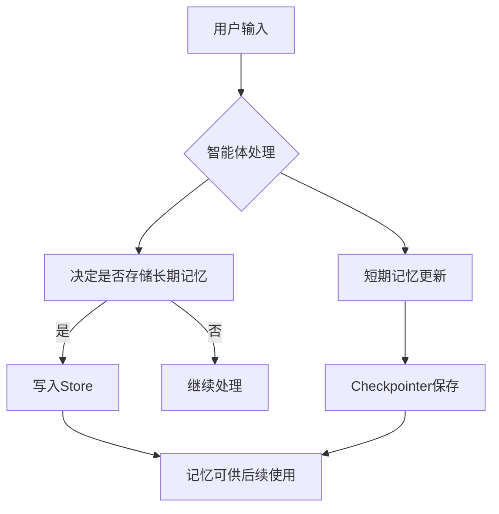

# LangGraph Memory 深入指南

## 目录
- [概述](#概述)
- [核心概念](#核心概念)
- [短期记忆 (Short-term Memory)](#短期记忆-short-term-memory)
- [长期记忆 (Long-term Memory)](#长期记忆-long-term-memory)
- [核心组件详解](#核心组件详解)
- [实战案例分析](#实战案例分析)
- [最佳实践](#最佳实践)
- [常见问题与解决方案](#常见问题与解决方案)

## 概述

Memory（记忆）是AI智能体的核心能力之一，它让智能体能够记住之前的交互、从反馈中学习并适应用户偏好。随着智能体处理更复杂的任务和更多的用户交互，这种能力对于效率和用户满意度都变得至关重要。

### 为什么需要记忆？

想象一个没有记忆的智能体：
- 每次对话都从零开始
- 无法记住用户的偏好
- 重复犯同样的错误
- 无法建立连贯的对话体验

有了记忆系统，智能体可以：
- 🧠 **记住用户偏好**: "用户喜欢简洁的回答"
- 📚 **学习历史经验**: "上次这种问题用这个方法解决了"
- 🔄 **保持对话连贯性**: "我们刚才讨论的项目..."
- ⚡ **提高效率**: 避免重复询问相同信息

## 核心概念

LangGraph的记忆系统基于两个关键概念：**作用域**和**持久化**。

### 记忆类型分类

根据**作用域**，记忆分为两类：

```
┌─────────────────┬──────────────────┬────────────────────┐
│     类型        │     作用域       │      持久化方式    │
├─────────────────┼──────────────────┼────────────────────┤
│ 短期记忆        │ 单个对话线程     │ Checkpointer      │
│ (Short-term)    │ (Thread-scoped)  │                   │
├─────────────────┼──────────────────┼────────────────────┤
│ 长期记忆        │ 跨线程/跨会话    │ Store             │
│ (Long-term)     │ (Cross-session)  │                   │
└─────────────────┴──────────────────┴────────────────────┘
```

### 记忆的生命周期



## 短期记忆 (Short-term Memory)

短期记忆让应用程序能够记住单个线程或对话中的先前交互。

### 什么是Thread（线程）？

Thread类似于邮件中的对话线程，将多个交互组织在一个会话中：

```python
# 同一个Thread中的多轮对话
thread_id = "user-123-conversation-1"

# 第一轮
await graph.ainvoke(
    {"messages": [("user", "我叫Alice")]},
    {"thread_id": thread_id}
)

# 第二轮 - 智能体记得第一轮的内容
await graph.ainvoke(
    {"messages": [("user", "我刚才说我叫什么？")]},
    {"thread_id": thread_id}
)
```

### 短期记忆的实现原理

LangGraph通过**State**和**Checkpointer**管理短期记忆：

```python
from langgraph.graph import StateGraph
from langgraph.checkpoint.memory import MemorySaver
from memory_agent.state import State

# State定义了要记住的数据结构
@dataclass(kw_only=True)
class State:
    messages: Annotated[list[AnyMessage], add_messages]
    # 其他状态数据...

# Checkpointer负责持久化State
checkpointer = MemorySaver()
graph = builder.compile(checkpointer=checkpointer)
```

### 短期记忆的挑战

1. **上下文窗口限制**: 对话历史可能超出LLM的上下文窗口
2. **性能问题**: 长对话导致响应变慢、成本增加
3. **注意力分散**: LLM在长上下文中容易被无关信息干扰

### 解决方案

```python
# 示例：限制消息历史长度
def manage_conversation_history(messages, max_messages=10):
    if len(messages) > max_messages:
        # 保留系统消息和最近的消息
        system_messages = [m for m in messages if m.type == "system"]
        recent_messages = messages[-max_messages:]
        return system_messages + recent_messages
    return messages
```

## 长期记忆 (Long-term Memory)

长期记忆让系统能够跨不同对话或会话保留信息，存储在自定义的"命名空间"中。

### 长期记忆的类型

根据[心理学研究](https://langchain-ai.github.io/langgraph/concepts/memory/)和[CoALA论文](https://langchain-ai.github.io/langgraph/concepts/memory/)，可以将记忆分为三类：

#### 1. 语义记忆 (Semantic Memory)

**存储内容**: 事实和概念
**人类例子**: 学校学到的知识
**智能体例子**: 用户的基本信息

```python
# Profile模式 - 单个持续更新的用户档案
user_profile = {
    "name": "Alice",
    "preferences": {
        "communication_style": "简洁直接",
        "language": "中文",
        "expertise": "机器学习"
    },
    "dietary_restrictions": ["素食主义者"],
    "timezone": "Asia/Shanghai"
}

# Collection模式 - 多个独立的记忆文档
memories = [
    {
        "content": "用户Alice喜欢简洁的回答",
        "context": "在技术讨论中提到",
        "timestamp": "2024-01-15"
    },
    {
        "content": "用户是素食主义者",
        "context": "讨论餐厅推荐时提到",
        "timestamp": "2024-01-16"
    }
]
```

#### 2. 情节记忆 (Episodic Memory)

**存储内容**: 经历和行动
**人类例子**: 做过的事情
**智能体例子**: 过去的智能体行动

```python
# 通过Few-shot示例实现
episodic_examples = [
    {
        "situation": "用户询问Python代码优化",
        "action": "提供具体的代码示例和性能对比",
        "outcome": "用户满意，问题解决"
    },
    {
        "situation": "用户报告bug",
        "action": "要求提供复现步骤和环境信息",
        "outcome": "成功定位并修复问题"
    }
]
```

#### 3. 程序记忆 (Procedural Memory)

**存储内容**: 规则和指令
**人类例子**: 本能或运动技能
**智能体例子**: 系统提示词

```python
# 动态更新的系统指令
procedural_memory = {
    "instructions": """
    你是一个技术助手。根据用户反馈，你应该：
    1. 对Alice使用简洁的语言
    2. 优先提供Python代码示例
    3. 避免推荐包含肉类的食物
    """,
    "updated_at": "2024-01-20",
    "feedback_incorporated": [
        "用户反馈：回答太啰嗦",
        "用户反馈：需要更多代码示例"
    ]
}
```

### 记忆写入策略

#### 热路径写入 (In the Hot Path)

在运行时实时创建记忆：

```python
async def call_model(state: State, runtime: Runtime[Context]) -> dict:
    # ... 处理用户消息 ...
    
    # 智能体决定是否需要存储记忆
    msg = await current_llm.bind_tools([tools.upsert_memory]).ainvoke(
        [{"role": "system", "content": sys}, *state.messages],
    )
    return {"messages": [msg]}

async def store_memory(state: State, runtime: Runtime[Context]):
    # 执行记忆存储
    tool_calls = getattr(state.messages[-1], "tool_calls", [])
    # ... 存储逻辑 ...
```

**优点**:
- ✅ 实时更新，立即可用
- ✅ 用户可见，透明度高
- ✅ 上下文丰富

**缺点**:
- ❌ 增加响应延迟
- ❌ 增加系统复杂性
- ❌ 可能影响主要任务

#### 后台写入 (In the Background)

作为后台任务创建记忆：

```python
# 后台记忆服务
class MemoryService:
    async def process_conversation(self, thread_id: str):
        # 分析对话历史
        conversation = await self.get_conversation(thread_id)
        
        # 提取重要信息
        memories = await self.extract_memories(conversation)
        
        # 存储到长期记忆
        for memory in memories:
            await self.store.put(
                namespace=("user", memory.user_id),
                key=memory.id,
                value=memory.dict()
            )
```

**优点**:
- ✅ 不影响主应用延迟
- ✅ 逻辑分离，更清晰
- ✅ 可以批量处理

**缺点**:
- ❌ 不是实时的
- ❌ 需要决定触发时机
- ❌ 复杂的调度逻辑

## 核心组件详解

### Store - 长期记忆存储

Store是LangGraph用于存储长期记忆的核心组件。

#### 基本概念

```python
from langgraph.store.memory import InMemoryStore

# 创建Store实例
store = InMemoryStore()

# 命名空间 - 类似文件夹
namespace = ("memories", user_id)

# 键 - 类似文件名
key = "user-preferences"

# 值 - JSON文档
value = {
    "communication_style": "简洁",
    "preferred_language": "中文"
}

# 存储记忆
store.put(namespace, key, value)

# 检索记忆
memory = store.get(namespace, key)

# 搜索记忆
memories = store.search(namespace, query="语言偏好")
```

#### 命名空间设计

良好的命名空间设计对于记忆管理至关重要：

```python
# 按用户组织
namespace = ("memories", "user-123")

# 按用户和应用上下文组织
namespace = ("memories", "user-123", "tech-support")

# 按组织和部门组织
namespace = ("memories", "org-456", "engineering", "team-alpha")

# 层次化结构
namespace = ("app", "users", user_id, "preferences")
```

#### Store的高级功能

```python
# 1. 语义搜索
def embed(texts: list[str]) -> list[list[float]]:
    # 使用实际的嵌入函数
    return embeddings.embed_documents(texts)

store = InMemoryStore(index={"embed": embed, "dims": 384})

# 搜索相似内容
similar_memories = store.search(
    namespace=("memories", user_id),
    query="用户的食物偏好",
    limit=5
)

# 2. 内容过滤
filtered_memories = store.search(
    namespace=("memories", user_id),
    filter={"category": "preferences"},
    query="通信方式"
)

# 3. 批量操作
memories_to_store = [
    {"key": "pref-1", "value": {"type": "food", "content": "素食"}},
    {"key": "pref-2", "value": {"type": "comm", "content": "简洁"}}
]

for item in memories_to_store:
    store.put(namespace, item["key"], item["value"])
```

### Checkpointer - 短期记忆持久化

Checkpointer负责保存和恢复图的状态。

#### 类型选择

```python
# 1. 内存存储 - 仅用于测试
from langgraph.checkpoint.memory import MemorySaver
checkpointer = MemorySaver()

# 2. SQLite存储 - 本地开发
from langgraph.checkpoint.sqlite import SqliteSaver
checkpointer = SqliteSaver.from_conn_string("checkpoints.db")

# 3. PostgreSQL存储 - 生产环境
from langgraph.checkpoint.postgres import PostgresSaver
checkpointer = PostgresSaver.from_conn_string("postgresql://...")

# 4. Redis存储 - 高性能需求
# 需要额外的Redis checkpointer包
```

#### 检查点的生命周期

```python
# 图编译时配置checkpointer
graph = builder.compile(checkpointer=checkpointer)

# 每次调用时指定thread_id
result = await graph.ainvoke(
    input={"messages": [("user", "Hello")]},
    config={"thread_id": "conversation-123"}
)

# 状态会自动保存到checkpointer
# 下次使用相同thread_id时会自动恢复状态
```

### Context - 运行时上下文

Context提供运行时配置信息：

```python
@dataclass(kw_only=True)
class Context:
    user_id: str = "default"
    model: str = "anthropic/claude-3-5-sonnet-20240620"
    system_prompt: str = SYSTEM_PROMPT
    
    def __post_init__(self):
        # 从环境变量自动加载配置
        for f in fields(self):
            if getattr(self, f.name) == f.default:
                setattr(self, f.name, os.environ.get(f.name.upper(), f.default))

# 使用Context
context = Context(
    user_id="alice-123",
    model="azure_openai/gpt-4o"
)

result = await graph.ainvoke(
    input={"messages": [("user", "Hello")]},
    config={"thread_id": "conv-1"},
    context=context
)
```

## 实战案例分析

让我们分析当前项目的记忆系统实现：

### 项目架构

```
memory-agent/
├── src/memory_agent/
│   ├── graph.py          # 主要的图逻辑
│   ├── tools.py          # 记忆操作工具
│   ├── context.py        # 运行时上下文
│   ├── state.py          # 状态定义
│   └── prompts.py        # 系统提示词
└── tests/
    └── integration_tests/
        └── test_graph.py # 集成测试
```

### 核心流程分析

#### 1. 状态定义

```python
# src/memory_agent/state.py
@dataclass(kw_only=True)
class State:
    messages: Annotated[list[AnyMessage], add_messages]
    """对话消息 - 短期记忆的载体"""
```

#### 2. 图结构

```python
# src/memory_agent/graph.py
builder = StateGraph(State, context_schema=Context)

# 核心节点
builder.add_node(call_model)      # 调用LLM，决定是否存储记忆
builder.add_node(store_memory)    # 执行记忆存储

# 流程控制
builder.add_edge("__start__", "call_model")
builder.add_conditional_edges("call_model", route_message, ["store_memory", END])
builder.add_edge("store_memory", "call_model")
```

#### 3. 记忆存储工具

```python
# src/memory_agent/tools.py
async def upsert_memory(
    content: str,          # 记忆内容
    context: str,          # 记忆上下文
    memory_id: Optional[uuid.UUID] = None,  # 可选的记忆ID
    user_id: Annotated[str, InjectedToolArg],      # 自动注入的用户ID
    store: Annotated[BaseStore, InjectedToolArg],  # 自动注入的存储
):
    """插入或更新记忆"""
    mem_id = memory_id or uuid.uuid4()
    await store.aput(
        ("memories", user_id),  # 命名空间
        key=str(mem_id),        # 键
        value={"content": content, "context": context},  # 值
    )
    return f"Stored memory {mem_id}"
```

#### 4. 模型调用逻辑

```python
async def call_model(state: State, runtime: Runtime[Context]) -> dict:
    user_id = runtime.context.user_id
    model = runtime.context.model
    
    # 1. 检索相关记忆
    memories = await cast(BaseStore, runtime.store).asearch(
        ("memories", user_id),
        query=str([m.content for m in state.messages[-3:]]),
        limit=10,
    )
    
    # 2. 格式化记忆为上下文
    formatted = "\n".join(
        f"[{mem.key}]: {mem.value} (similarity: {mem.score})" 
        for mem in memories
    )
    
    # 3. 构建系统提示词
    sys = system_prompt.format(
        user_info=formatted, 
        time=datetime.now().isoformat()
    )
    
    # 4. 调用LLM，绑定记忆工具
    msg = await current_llm.bind_tools([tools.upsert_memory]).ainvoke(
        [{"role": "system", "content": sys}, *state.messages],
    )
    return {"messages": [msg]}
```

### 测试用例分析

让我们看看测试是如何验证记忆功能的：

```python
# tests/integration_tests/test_graph.py
async def test_memory_storage(conversation: List[str]):
    # 1. 创建测试环境
    mem_store = InMemoryStore()
    graph = builder.compile(store=mem_store, checkpointer=MemorySaver())
    user_id = "test-user"
    
    # 2. 模拟对话
    for content in conversation:
        await graph.ainvoke(
            {"messages": [("user", content)]},
            {"thread_id": "thread"},
            context=Context(user_id=user_id, model="azure_openai/gpt-4o"),
        )
    
    # 3. 验证记忆存储
    namespace = ("memories", user_id)
    memories = mem_store.search(namespace)
    
    print(memories)  # 输出存储的记忆
    
    # 4. 验证记忆数量
    assert len(memories) > 0, f"应该至少存储一条记忆，但实际存储了 {len(memories)} 条"
    
    # 5. 验证用户隔离
    bad_namespace = ("memories", "wrong-user")
    bad_memories = mem_store.search(bad_namespace)
    assert len(bad_memories) == 0, f"错误用户ID不应该能访问记忆"
```

### 实际运行结果

当我们运行测试时，可以看到实际存储的记忆：

```python
# 短对话场景
[Item(namespace=['memories', 'test-user'], 
 key='7e4ffcdc-bc7e-458e-ba15-a22f5b6ad9e8', 
 value={'content': "User's name is Alice and she loves pizza.", 
        'context': 'Alice introduced herself and shared her love for pizza.'}, 
 created_at='2025-08-25T07:45:56.829644+00:00')]

# 中等对话场景 - 存储了4条记忆
# 长对话场景 - 存储了2条记忆
```

## 最佳实践

### 1. 命名空间设计

```python
# ✅ 好的命名空间设计
namespace = ("memories", user_id)                    # 按用户隔离
namespace = ("memories", user_id, "preferences")     # 按类型细分
namespace = ("org", org_id, "users", user_id)       # 层次化结构

# ❌ 避免的设计
namespace = ("all_memories",)                        # 没有隔离
namespace = (f"user_{user_id}_memories",)           # 扁平结构
```

### 2. 记忆内容结构

```python
# ✅ 结构化的记忆内容
memory_value = {
    "content": "用户Alice喜欢简洁的回答",
    "context": "在技术讨论中多次提到",
    "category": "communication_preference",
    "confidence": 0.9,
    "source": "conversation",
    "created_at": datetime.now().isoformat()
}

# ❌ 避免的结构
memory_value = "Alice likes short answers"  # 缺乏结构
```

### 3. 记忆检索策略

```python
# ✅ 智能检索策略
async def get_relevant_memories(store, user_id, query, max_memories=10):
    # 1. 语义搜索
    semantic_memories = await store.asearch(
        namespace=("memories", user_id),
        query=query,
        limit=max_memories // 2
    )
    
    # 2. 最近记忆
    recent_memories = await store.asearch(
        namespace=("memories", user_id),
        filter={"created_at": {"$gte": one_week_ago()}},
        limit=max_memories // 2
    )
    
    # 3. 去重和排序
    all_memories = deduplicate_memories(semantic_memories + recent_memories)
    return sort_by_relevance(all_memories)[:max_memories]
```

### 4. 错误处理和恢复

```python
# ✅ 健壮的错误处理
async def safe_memory_operation(store, operation, *args, **kwargs):
    try:
        return await operation(store, *args, **kwargs)
    except Exception as e:
        logger.error(f"Memory operation failed: {e}")
        # 记录错误但不中断主流程
        return None

# 在主逻辑中使用
memories = await safe_memory_operation(
    store, store.asearch, 
    namespace, query=query
) or []  # 提供默认值
```

### 5. 性能优化

```python
# ✅ 批量操作
async def batch_store_memories(store, namespace, memories):
    tasks = [
        store.aput(namespace, mem["key"], mem["value"])
        for mem in memories
    ]
    await asyncio.gather(*tasks, return_exceptions=True)

# ✅ 缓存策略
from functools import lru_cache

@lru_cache(maxsize=100)
def get_user_preferences(user_id):
    # 缓存用户偏好以减少数据库访问
    pass
```

### 6. 数据一致性

```python
# ✅ 事务性操作
async def update_user_profile(store, user_id, updates):
    namespace = ("profiles", user_id)
    
    # 获取当前配置文件
    current = await store.aget(namespace, "profile")
    
    if current:
        # 更新现有配置文件
        updated_profile = {**current.value, **updates}
        await store.aput(namespace, "profile", updated_profile)
    else:
        # 创建新配置文件
        await store.aput(namespace, "profile", updates)
```

## 常见问题与解决方案

### Q1: 记忆过多导致检索缓慢

**问题**: 随着时间推移，存储的记忆越来越多，检索变慢。

**解决方案**:
```python
# 1. 记忆过期机制
async def cleanup_old_memories(store, namespace, days_old=30):
    cutoff_date = datetime.now() - timedelta(days=days_old)
    
    # 查找过期记忆
    old_memories = await store.asearch(
        namespace,
        filter={"created_at": {"$lt": cutoff_date.isoformat()}}
    )
    
    # 删除过期记忆
    for memory in old_memories:
        await store.adelete(namespace, memory.key)

# 2. 记忆重要性评分
def calculate_memory_importance(memory):
    factors = {
        "recency": get_recency_score(memory.created_at),
        "frequency": get_access_frequency(memory.key),
        "relevance": get_relevance_score(memory.content)
    }
    return sum(factors.values()) / len(factors)

# 3. 智能记忆合并
async def merge_similar_memories(store, namespace):
    memories = await store.asearch(namespace)
    similar_groups = find_similar_memories(memories)
    
    for group in similar_groups:
        merged = merge_memory_group(group)
        # 删除原记忆，存储合并后的记忆
        for old_memory in group:
            await store.adelete(namespace, old_memory.key)
        await store.aput(namespace, merged.key, merged.value)
```

### Q2: 记忆内容质量问题

**问题**: LLM生成的记忆内容不准确或冗余。

**解决方案**:
```python
# 1. 记忆验证
async def validate_memory(content, context):
    validation_prompt = f"""
    请评估以下记忆的质量：
    内容: {content}
    上下文: {context}
    
    评估标准:
    1. 准确性 (1-5)
    2. 相关性 (1-5) 
    3. 唯一性 (1-5)
    
    返回JSON格式的评分。
    """
    
    validation = await llm.ainvoke(validation_prompt)
    scores = json.loads(validation.content)
    
    # 只存储高质量记忆
    if all(score >= 3 for score in scores.values()):
        return True
    return False

# 2. 记忆去重
def is_duplicate_memory(new_memory, existing_memories):
    for existing in existing_memories:
        similarity = calculate_similarity(
            new_memory["content"], 
            existing.value["content"]
        )
        if similarity > 0.8:  # 80%相似度阈值
            return True
    return False
```

### Q3: 跨线程记忆一致性

**问题**: 在一个线程中更新的记忆在其他线程中不可见。

**解决方案**:
```python
# 1. 记忆同步机制
class MemorySync:
    def __init__(self, store):
        self.store = store
        self.cache = {}
        self.last_sync = {}
    
    async def get_memories(self, namespace):
        # 检查是否需要同步
        if self.should_sync(namespace):
            self.cache[namespace] = await self.store.asearch(namespace)
            self.last_sync[namespace] = time.time()
        
        return self.cache.get(namespace, [])
    
    def should_sync(self, namespace):
        return (
            namespace not in self.cache or 
            time.time() - self.last_sync.get(namespace, 0) > 60  # 1分钟同步一次
        )

# 2. 事件驱动更新
class MemoryEventSystem:
    def __init__(self):
        self.listeners = defaultdict(list)
    
    def subscribe(self, namespace, callback):
        self.listeners[namespace].append(callback)
    
    async def notify(self, namespace, event_type, memory):
        for callback in self.listeners[namespace]:
            await callback(event_type, memory)
```

### Q4: 记忆隐私和安全

**问题**: 敏感信息被意外存储或泄露。

**解决方案**:
```python
# 1. 敏感信息检测
import re

def contains_sensitive_info(text):
    patterns = [
        r'\b\d{4}[-\s]?\d{4}[-\s]?\d{4}[-\s]?\d{4}\b',  # 信用卡号
        r'\b\d{3}-\d{2}-\d{4}\b',  # SSN
        r'\b[A-Za-z0-9._%+-]+@[A-Za-z0-9.-]+\.[A-Z|a-z]{2,}\b',  # 邮箱
    ]
    
    for pattern in patterns:
        if re.search(pattern, text):
            return True
    return False

# 2. 记忆加密
from cryptography.fernet import Fernet

class EncryptedStore:
    def __init__(self, base_store, encryption_key):
        self.base_store = base_store
        self.cipher = Fernet(encryption_key)
    
    async def aput(self, namespace, key, value):
        encrypted_value = self.cipher.encrypt(
            json.dumps(value).encode()
        )
        await self.base_store.aput(namespace, key, encrypted_value)
    
    async def aget(self, namespace, key):
        encrypted_value = await self.base_store.aget(namespace, key)
        if encrypted_value:
            decrypted_data = self.cipher.decrypt(encrypted_value.value)
            value = json.loads(decrypted_data.decode())
            return Item(namespace=namespace, key=key, value=value)
        return None

# 3. 访问控制
class AccessControlledStore:
    def __init__(self, base_store):
        self.base_store = base_store
        self.permissions = {}
    
    def grant_access(self, user_id, namespace, permissions):
        self.permissions[(user_id, namespace)] = permissions
    
    async def aput(self, namespace, key, value, user_id=None):
        if not self.has_permission(user_id, namespace, "write"):
            raise PermissionError("No write access")
        return await self.base_store.aput(namespace, key, value)
```

### Q5: 记忆系统监控和调试

**问题**: 难以监控记忆系统的运行状态和调试问题。

**解决方案**:
```python
# 1. 记忆操作日志
import logging

memory_logger = logging.getLogger("memory_system")

class LoggingStore:
    def __init__(self, base_store):
        self.base_store = base_store
    
    async def aput(self, namespace, key, value):
        memory_logger.info(f"Storing memory: {namespace}/{key}")
        result = await self.base_store.aput(namespace, key, value)
        memory_logger.info(f"Memory stored successfully: {namespace}/{key}")
        return result
    
    async def asearch(self, namespace, **kwargs):
        memory_logger.info(f"Searching memories: {namespace}, query={kwargs.get('query')}")
        results = await self.base_store.asearch(namespace, **kwargs)
        memory_logger.info(f"Found {len(results)} memories")
        return results

# 2. 记忆统计
class MemoryMetrics:
    def __init__(self):
        self.stats = {
            "total_memories": 0,
            "memories_by_namespace": defaultdict(int),
            "search_count": 0,
            "cache_hits": 0,
            "cache_misses": 0
        }
    
    def record_memory_stored(self, namespace):
        self.stats["total_memories"] += 1
        self.stats["memories_by_namespace"][str(namespace)] += 1
    
    def record_search(self, hit=False):
        self.stats["search_count"] += 1
        if hit:
            self.stats["cache_hits"] += 1
        else:
            self.stats["cache_misses"] += 1
    
    def get_stats(self):
        return dict(self.stats)

# 3. 健康检查
async def memory_health_check(store):
    try:
        # 测试基本操作
        test_namespace = ("health_check",)
        test_key = "test"
        test_value = {"timestamp": time.time()}
        
        await store.aput(test_namespace, test_key, test_value)
        result = await store.aget(test_namespace, test_key)
        await store.adelete(test_namespace, test_key)
        
        return {
            "status": "healthy",
            "operations": ["put", "get", "delete"],
            "timestamp": datetime.now().isoformat()
        }
    except Exception as e:
        return {
            "status": "unhealthy",
            "error": str(e),
            "timestamp": datetime.now().isoformat()
        }
```

## 总结

LangGraph的记忆系统为AI智能体提供了强大而灵活的记忆能力。通过理解**短期记忆**和**长期记忆**的区别，掌握**Store**、**Checkpointer**和**Context**等核心组件的使用，开发者可以构建出具有学习和适应能力的智能应用。

关键要点回顾：

1. **记忆分类**: 短期记忆用于单线程上下文，长期记忆用于跨会话信息
2. **核心组件**: Store负责长期存储，Checkpointer负责状态持久化，Context提供运行时配置
3. **设计原则**: 合理的命名空间设计、结构化的记忆内容、智能的检索策略
4. **实践经验**: 从本项目的实现中学习最佳实践和常见陷阱

随着AI技术的发展，记忆系统将变得越来越重要。掌握这些概念和技术，将帮助您构建更智能、更有用的AI应用。

---

**参考资料**:
- [LangGraph Memory 官方文档](https://langchain-ai.github.io/langgraph/concepts/memory/)
- [CoALA论文](https://langchain-ai.github.io/langgraph/concepts/memory/) - AI智能体记忆类型研究
- 本项目源码 - 实际的记忆系统实现示例
